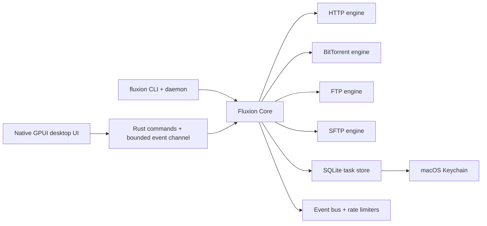

<div align="center">
  

  <h1>Fluxion</h1>

  <p><strong>A native, multi-protocol download manager for macOS.</strong></p>

  <p>
    
    
    
    
    <a href="LICENSE"></a>
  </p>
</div>

Fluxion combines a GPU-rendered Rust/GPUI desktop app, a reusable Rust core, and a daemon-backed CLI. It is designed for long-running transfers that need clear state, predictable resume behavior, per-task controls, and local handling of credentials.

> [!IMPORTANT]
> Fluxion is under active development. Storage formats, command-line flags, and protocol behavior may change before the first stable release.

The native interface preserves the sidebar, task list and inspector layout, with
light/dark themes and compact task controls. See [native desktop notes](docs/native-desktop.md).

## Highlights

- HTTP and HTTPS downloads with redirect probing, Range detection, segmented transfers, resume validators, retries, and single-connection fallback.
- BitTorrent downloads from torrent files and magnet links, with file selection, live piece/file state, seeding, share-ratio limits, and trackers.
- FTP and SFTP downloads with partial-file resume; SFTP uses trust-on-first-use host-key verification.
- Global and per-task upload/download limits plus direct or system-proxy routing.
- Task lifecycle controls, batch actions, search, filters, a trash workflow, and signed application updates.
- English, Simplified Chinese, Japanese, and Korean interface languages.
- A daemon-backed CLI for automation, events, settings, and redacted diagnostics.

## Protocol Status

| Protocol | Status | Current behavior |
| --- | --- | --- |
| HTTP / HTTPS | Available | Segmented downloads, resume, retry, redirect and Range probing, custom headers |
| BitTorrent | Available | Torrent and magnet input, file selection, DHT/trackers, seeding and rate limits |
| FTP | Available | Passive or active mode, partial-file resume, anonymous or credentialed access |
| SFTP | Available | Password or private-key authentication, resume, TOFU host-key checks |
| FTPS | Not yet supported | The task model is reserved, but the engine intentionally rejects FTPS today |
| Browser capture | Planned | Native Messaging handoff is documented but not implemented yet |

## Architecture



The workspace keeps protocol engines and platform concerns separate:

| Crate | Responsibility |
| --- | --- |
| `fluxion-core` | Task model, lifecycle, scheduler, events, limits, redaction, shared abstractions |
| `fluxion-http` | HTTP probing, segmentation, retries, resume, and positioned writes |
| `fluxion-bt` | BitTorrent integration through `librqbit` |
| `fluxion-ftp` / `fluxion-sftp` | FTP and SFTP transfer engines |
| `fluxion-storage` | SQLite persistence and secret-reference handling |
| `fluxion-platform` | Keychain and operating-system services |
| `fluxion-runtime` | Production assembly of Core, storage, and engines |
| `desktop/native/backend.rs` | Native App/Core commands, redacted snapshots, event delivery |
| `fluxion-cli` | CLI, daemon, Unix-socket IPC, events, and diagnostics |

## Development

### Requirements

- macOS with Xcode Command Line Tools
- Rust `1.96.0`
- Python 3 for macOS app bundling (Node.js is only used by release manifest tooling)

### Desktop app

```bash
cargo run -p fluxion-app
```

Build a standalone native app (all icons and translations are embedded):

```bash
python3 scripts/bundle-macos.py --release
open target/native/release/bundle/Fluxion.app
```

For isolated manual testing, `python3 scripts/bundle-macos.py --preview` creates
`target/native/debug/bundle/Fluxion Preview.app` with a separate application identity
and `/tmp/fluxion-gpui-ui-check` data directory. No browser, dev server or JavaScript
runtime is used by the desktop app.

### CLI and daemon

```bash
cargo build -p fluxion-cli --bins
./target/debug/fluxion daemon start
./target/debug/fluxion task add http \
  https://example.com/archive.zip \
  --save-dir "$HOME/Downloads" \
  --max-connections 16
```

Explore the command surface with `fluxion --help` and `fluxion task add --help`.

### Verification

```bash
cargo fmt --all -- --check
cargo check --workspace --all-targets
cargo test --workspace

cargo test -p fluxion-app

node --test scripts/release/create-update-manifest.test.mjs
```

## Security And Privacy

Fluxion is local-first. The desktop creation flow separates sensitive request headers and transfer credentials from ordinary task metadata; production storage keeps secret payloads in macOS Keychain and persists only references in SQLite. Task details and diagnostic exports are redacted, inferred filenames are sanitized, and App file operations verify that resolved paths remain inside the selected download directory.

Please review [SECURITY.md](SECURITY.md) before reporting a vulnerability. Do not include live credentials, private tracker URLs, signed download URLs, or private keys in a public issue.

## Releases

The release workflow builds a signed universal macOS app and DMG, generates signed native updater archives, and publishes immutable versioned files before advancing a channel manifest. Maintainer setup and tag conventions are documented in [docs/releasing.md](docs/releasing.md).

## Contributing

Focused issues and pull requests are welcome. Keep changes scoped to the relevant crate or App boundary, add tests proportional to the behavior changed, and run the verification commands above before submitting.

## License

Fluxion is licensed under the [Apache License 2.0](LICENSE).
